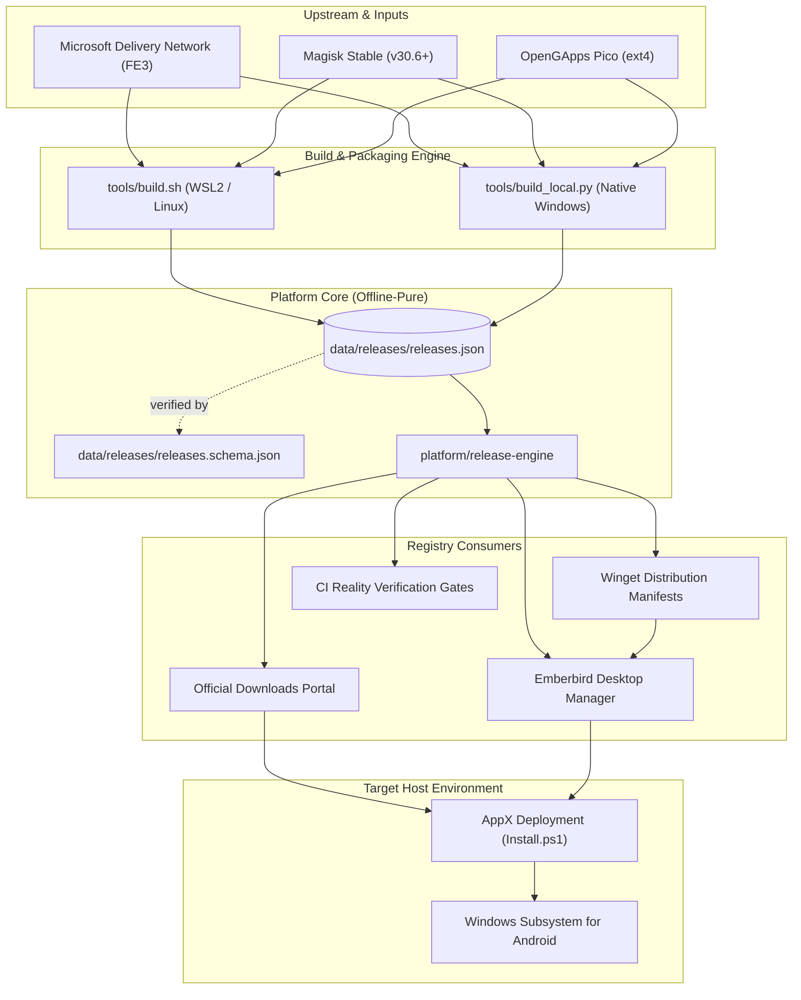
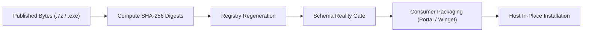

# Emberbird — A Lifecycle Platform for Android on Windows

<p align="center">
  
  
  
  
  
  
  
  
</p>

<p align="center">
  <a href="https://wsabuilds-website.pages.dev"><strong>🌐 Official Website &amp; Downloads Portal</strong></a> — interactive documentation, compatibility hub, and diagnostic wizard
</p>

> **From the ashes of a discontinued platform, a living one.** Microsoft ended
> Windows Subsystem for Android development in March 2025. Emberbird carries the
> work forward: patched, verified, registry-driven builds — a modified Windows
> Subsystem for Android distribution, evolved from the
> [WSABuilds](https://github.com/MustardChef/WSABuilds) and MagiskOnWSA lineage
> under AGPL-3.0, with every upstream credit intact
> ([full attribution](docs/ATTRIBUTION.md),
> [historical lineage](docs/HISTORICAL_PRESERVATION.md)).

---

## 1. Hero & Project Introduction

**Emberbird** is an open-source engineering, packaging, and lifecycle platform for the **Windows Subsystem for Android (WSA)** on Windows 11 and Windows 10. Following Microsoft's deprecation of WSA in March 2025, Emberbird sustains and stabilizes patched subsystem builds with integrated Google Play services, verified root options, and automated lifecycle management.

Built around a frozen **Release Registry**, Emberbird guarantees that every published build, hash, and download URL is mathematically verifiable from published bytes.

* **Flagship Subsystem**: WSA `2407.40000.4.0` (Android 13, API 33)
* **Editions**: Standard Edition (Magisk Root) and Banking Edition (Vanilla Non-Root)
* **Desktop Client**: Emberbird Manager v0.2.2 (`Emberbird.Manager`)
* **Target OS**: Windows 11 (Build 22000+) & Windows 10 22H2 (Build 19045.2311+)

---

## 2. Mission

The mission of Project Emberbird is to deliver a durable, verifiable, and single-maintainer-resilient distribution platform for Android on Windows:

1. **Sustain Without Bloat**: Deliver lean, patched Android subsystem distributions without proprietary telemetry, ad-ware, or speculative forks.
2. **Registry-Driven Truth**: Eliminate guessing, scraping, and broken mirrors by anchoring all release metadata to an immutable, schema-validated release registry.
3. **Preserve Subsystem Identity**: Preserve official Microsoft AppX package identity (`MicrosoftCorporationII.WindowsSubsystemForAndroid_8wekyb3d8bbwe`), ensuring seamless in-place updates without user application data loss.
4. **Honest Architectural Boundaries**: Clearly separate rooted developer environments from pristine banking/DRM environments, and never claim ownership of Microsoft's proprietary subsystem binaries.

---

## 3. Why Emberbird Exists

When Microsoft deprecated the Windows Subsystem for Android, users faced broken download mirrors, unverified forks containing questionable binary modifications, and fragmented documentation. Emberbird was engineered to solve these systemic failure points:

| Upstream Failure Point | Emberbird Architectural Solution |
|---|---|
| **Drifting & Inaccurate Hashes** | Central release registry (`data/releases/releases.json`) validated by Draft-07 JSON Schema; placeholder hashes structurally rejected. |
| **Silent Upgrade Breakages** | Preserved AppX identity and cold VHDX snapshot backups guarantee in-place updates retain all user data (`userdata.vhdx`). |
| **Conflated Root & Clean Builds** | Explicit Tier-1 editions: Standard (rooted with Magisk Stable) and Banking (completely unrooted vanilla ramdisk). |
| **Brittle Release Discovery** | **Registry Independence**: website, manager, and CLI resolve metadata strictly offline from the registry, never scraping GitHub. |
| **Loss of Project Lineage** | Immutable historical manifests (M4) and permanent upstream attribution (S1) honoring the original developers. |

---

## 4. Project Story

Emberbird represents the evolution of community engineering across three distinct eras:

1. **The Origin Era (MagiskOnWSA / MagiskOnWSALocal)**: Pioneered community patching of WSA MSIX packages, enabling root execution and Google Play Store integration on desktop hardware.
2. **The WSABuilds Era (MustardChef)**: Standardized reproducible automated packaging, established dual-edition builds (Magisk vs Vanilla), created the original desktop manager client, and built the extensive troubleshooting documentation.
3. **The Emberbird Era (Stewardship Edition)**: Metamorphosed the repository into a formal platform. Established frozen contracts, an authoritative release registry, an offline-pure Release Engine, unified brand consistency, and long-term repository governance without architectural drift.

The name **Emberbird** reflects this journey: sustaining the sparks of a deprecated platform into an independent, living open-source ecosystem.

---

## 5. Architecture Diagram

The platform operates as a unidirectional, registry-driven pipeline where published artifacts are the sole ground truth:



---

## 6. Registry Overview

The release registry (`data/releases/releases.json`) is the single authoritative source of release intelligence for the entire platform.

### Core Components

| Component | Path | Function |
|---|---|---|
| **Authoritative Registry** | `data/releases/releases.json` | Master catalog of every published release, channel, edition, package, and SHA-256 hash. |
| **Contract Schema** | `data/releases/releases.schema.json` | Draft-07 JSON Schema enforcing hash integrity, required fields, and structural consistency. |
| **Release Engine** | `platform/release-engine/` | Pure-offline Python package providing metadata lookup, integrity validation, and drift analysis. |
| **Generator** | `scripts/build_registry.py` | Idempotent generation tool syncing registry records from live published release bytes. |
| **Release Contract** | `data/contracts/release-contract.md` | Binding legal and architectural contract defining Registry Independence. |

### Invariant Rules
1. **Registry Independence**: No consumer may hardcode release tags, versions, or download links. All consumers query the registry.
2. **Published Artifacts Are Truth**: An entry exists in the registry only if its physical `.7z` or `.exe` assets are published and their SHA-256 hashes are computed from actual bytes.
3. **Artifact Identity**: Identity is defined as `(artifact_name + sha256)`. Different cuts of the same filename are tracked individually in the vault.

### Registry Verification Command

```powershell
python platform/release-engine/release_engine/__main__.py validate --schema
```
*Outputs `REGISTRY OK` and `SCHEMA OK` confirming 100% contract compliance.*

---

## 7. Release Lifecycle

Every release follows a strict multi-gate promotion lifecycle:



1. **Artifact Compilation**: Subsystem packages are assembled with signed AppX manifests, patched ramdisks, and OpenGApps overlays.
2. **Cryptographic Sealing**: SHA-256 hashes are calculated and published in `checksums.txt` alongside validation reports.
3. **Registry Ingestion**: `scripts/build_registry.py` records the release, assigns edition tags, and catalogs assets into the vault.
4. **Reality Verification**: CI verifies the updated registry against `releases.schema.json` and runs consumer parity checks.
5. **Distribution Sync**: Portal and desktop manager update their views deterministically from the refreshed registry.

---

## 8. Features & Supported Editions

Emberbird distributes two purpose-built Tier-1 editions plus a native desktop companion:

| Feature / Property | Standard Edition (Rooted) | Banking & Enterprise Edition (Vanilla) |
|---|---|---|
| **Primary Target** | Developers, modders, power users | Everyday users, banking, UPI, DRM streaming |
| **Root Solution** | **Magisk Stable (v30.6+)** integrated | **Vanilla (Clean Ramdisk, Zero Root)** |
| **Google Services** | OpenGApps Pico (Play Store + Play Services) | OpenGApps Pico (Play Store + Play Services) |
| **Device Spoofing** | Pixel 5 (`redfin`) Play Protect fingerprint | Pixel 5 (`redfin`) Play Protect fingerprint |
| **Root Privileges** | Elevated UID 0 ADB shell & Magisk Manager | No `su` binary, no daemon, no root hooks |
| **Banking / UPI Apps** | Requires DenyList / Shamiko workarounds | **Native out-of-the-box compatibility** |
| **In-Place Upgrades** | Lossless user data retention | Lossless user data retention |
| **Architecture** | **x86_64 (Production)** | **x86_64 (Production)** |

> [!NOTE]
> **ARM64 Status**: Native ARM64 packages are **NOT YET AVAILABLE** (not currently pre-built). Pre-built ARM64 packages are not published because Microsoft never published a retail ARM64 WSA MSIX. Technical research is documented in `docs/research/ARM64_CROSS_COMPILATION.md` and tracked on the roadmap (`TODO.md`).

---

## 9. Installation Guide

Installing Emberbird requires 3 simple steps without complex terminal commands:

### Step 1: Enable Hardware Virtualization
Open PowerShell as **Administrator** and run:
```powershell
dism.exe /online /enable-feature /featurename:VirtualMachinePlatform /all /norestart
dism.exe /online /enable-feature /featurename:HypervisorPlatform /all /norestart
```
*Reboot your PC if prompted. Ensure virtualization (Intel VT-x or AMD-V) is enabled in your BIOS/UEFI.*

### Step 2: Download & Extract Package
1. Download your preferred edition from the [Official Downloads Portal](https://wsabuilds-website.pages.dev/downloads) or the table in [Distribution](#15-distribution--package-managers).
2. Extract the downloaded `.7z` solid archive using **[7-Zip](https://www.7-zip.org/)** to a permanent directory on your fast drive (e.g. `C:\WSA` or `D:\Emberbird`).
3. *Do not extract to temporary directories like `Downloads\Temp`, as Windows runs the subsystem directly from this location.*

### Step 3: Run the Installer
1. Open the extracted folder and locate **`Install.ps1`**.
2. Right-click **`Install.ps1`** and select **Run with PowerShell** (or execute `.\Install.ps1` from an elevated PowerShell terminal).
3. The automated script enables Developer Mode, registers the AppX manifest, and launches the Windows Subsystem for Android.
4. Open the **Google Play Store**, sign in, and enjoy your apps!

> [!IMPORTANT]
> **Data-Preserving In-Place Upgrade Guarantee**: When updating to a newer release, **DO NOT UNINSTALL** your existing installation. Simply extract the new package to the same folder (or run `Install.ps1` from the new folder). Windows preserves all your installed Android apps, settings, and virtual disk data (`userdata.vhdx`).

---

## 10. Quick Start

### 5-Minute Install via Command Line
```powershell
# 1. Download official release
curl.exe -L -o WSA.7z https://github.com/IamAzmathullaShaikh/WSABuilds/releases/download/wsa-v2311.40000.5.0/WSA_2407.40000.4.0_x64.7z

# 2. Verify SHA-256 checksum
Get-FileHash -Algorithm SHA256 .\WSA.7z

# 3. Extract with 7-Zip & install
7z x .\WSA.7z -oC:\WSA
powershell.exe -ExecutionPolicy Bypass -File C:\WSA\Install.ps1
```

### Desktop Manager Install
```powershell
winget install Emberbird.Manager
```

---

## 11. Learning Path

Find the targeted documentation for your specific goal:

| I Want To... | Authoritative Guide | Focus Area |
|---|---|---|
| **Install & run Android apps** | [Installation Guide](#9-installation-guide) · [docs/LEARNING_PATH.md](docs/LEARNING_PATH.md) | End-user installation, in-place updates |
| **Verify package checksums** | [Registry Overview](#6-registry-overview) · `checksums.txt` | Cryptographic SHA-256 verification |
| **Inspect system architecture** | [docs/ARCHITECTURE.md](docs/ARCHITECTURE.md) · [docs/ADR.md](docs/ADR.md) | CPIO trampolines, AppX identity, ADRs |
| **Build from source on Windows 11** | [WINDOWS11_BUILD_GUIDE.md](WINDOWS11_BUILD_GUIDE.md) · [BUILD.md](BUILD.md) | WSL2 and native Windows builders |
| **Check app compatibility** | [Compatibility Hub](https://wsabuilds-website.pages.dev/compatibility) | Banking & DRM compatibility database |
| **Contribute code or reports** | [CONTRIBUTING.md](CONTRIBUTING.md) · [Developer Guide](#12-developer-guide) | Quality gates, unit test suite |
| **Review legal & attribution** | [docs/ATTRIBUTION.md](docs/ATTRIBUTION.md) · [docs/HISTORICAL_PRESERVATION.md](docs/HISTORICAL_PRESERVATION.md) | Ancestry, licensing, AGPL-3.0 |

---

## 12. Developer Guide

Emberbird is engineered for immediate developer onboarding:

### Prerequisites Setup
```powershell
# Install developer dependencies via winget
winget install --id Git.Git -e
winget install --id Python.Python.3.12 -e
winget install --id 7zip.7zip -e
winget install --id OpenJS.NodeJS.LTS -e
```

### Clone & Local Environment
```bash
git clone https://github.com/IamAzmathullaShaikh/Emberbird.git
cd Emberbird

python -m venv .venv
.\.venv\Scripts\Activate.ps1
python -m pip install jsonschema
```

### Running Local Validation
```powershell
# 1. Run full unit and contract test suite (289+ offline tests)
python -m unittest discover -s tests

# 2. Validate release registry against schema
python platform/release-engine/release_engine/__main__.py validate --schema

# 3. Check for broken internal documentation links
python scripts/check_doc_links.py

# 4. Run automated credential & secret scanner
python scripts/security_scan.py

# 5. Run distribution manifest validator
python scripts/validate_distribution.py
```

### Local Build Commands
```bash
# WSL2 / Linux pipeline:
cd tools
./build.sh --root-sol magisk --gapps pico --compress-format 7z

# Native Windows builder:
cd tools
python build_local.py --root-sol magisk --gapps pico
```

---

## 13. Contributor Guide

We welcome community contributions, bug fixes, and compatibility reports!

1. **Branching**: Branch off `main` for all features and bug fixes (`git checkout -b feature/my-change`).
2. **Quality Gates**: Ensure `unittest discover -s tests`, `validate --schema`, `security_scan.py`, and `check_doc_links.py` pass before opening your PR.
3. **Conventional Commits**: Format commit messages as `feat(scope): ...`, `fix(scope): ...`, or `docs(scope): ...`.
4. **Issue Forms**: Use structured [Issue Templates](.github/ISSUE_TEMPLATE/) for bug reports, compatibility submissions, and feature requests.
5. **Review Detailed Guidelines**: Read [CONTRIBUTING.md](CONTRIBUTING.md) for review SLAs and code of conduct.

---

## 14. Registry Consumers

All release-facing applications and distribution surfaces consume the release registry:

| Consumer | Implementation | Discovery Model | Status |
|---|---|---|---|
| **Official Web Portal** | `website/src/lib/release-service.ts` | Build-time import of `releases.json` | **100% Registry-Driven (E3B)** |
| **Emberbird Manager** | `apps/manager/src/lib/registry.ts` | Bundled offline registry resolution | **100% Registry-Driven (E3C)** |
| **Winget Tooling** | `scripts/bootstrap_winget.py` | Registry-derived installer URLs & hashes | **100% Registry-Driven (P0)** |
| **Release Engine** | `platform/release-engine/` | Metadata service, diff engine, validator | **100% Offline-Pure Core** |

The full compliance matrix is maintained in [docs/CONSUMER_MATRIX.md](docs/CONSUMER_MATRIX.md).

---

## 15. Distribution & Package Managers

### Official Release Packages (Tier 1 Production)

| Edition | Package Contents | Verified Download Target | Build Channel |
|---|---|---|---|
| **x64 Standard Edition** | • Magisk Stable (v30.6+)<br/>• OpenGApps Pico (Play Store + Services)<br/>• Automated Root & Pixel 5 Spoofing | [Download Standard Edition (x64)](https://github.com/IamAzmathullaShaikh/WSABuilds/releases/download/wsa-v2311.40000.5.0/WSA_2407.40000.4.0_x64.7z) | **Tier 1 (Production)** |
| **x64 Banking Edition** | • Vanilla (Clean Ramdisk, Zero Root)<br/>• OpenGApps Pico (Play Store + Services)<br/>• Pixel 5 Spoofing (Banking Safe) | [Download Banking Edition (x64)](https://github.com/IamAzmathullaShaikh/WSABuilds/releases/download/wsa-v2311.40000.5.0/WSA_2407.40000.4.0_x64_vanilla.7z) | **Tier 1 (Production)** |
| **arm64 Standard Edition** | • Magisk Stable<br/>• OpenGApps Pico (arm64)<br/>• Native Qualcomm Snapdragon ABI | **Not currently pre-built** — no ARM64 assets are published on GitHub Releases yet; ARM64 CI enablement is tracked on the engineering roadmap (see `TODO.md`, Task 4.2) | **Tier 2 (Planned)** |

### Desktop Manager Downloads

* **Portable Archive (.zip)**: [Download WSABuildsManager-Portable-0.2.2-x64.zip](https://github.com/IamAzmathullaShaikh/WSABuilds/releases/download/v0.2.2/WSABuildsManager-Portable-0.2.2-x64.zip) (Zero installation required)
* **Setup Installer (.exe)**: [Download WSABuildsManager-Setup-0.2.2-x64.exe](https://github.com/IamAzmathullaShaikh/WSABuilds/releases/download/v0.2.2/WSABuildsManager-Setup-0.2.2-x64.exe) (NSIS installation with Start Menu integration)
* **Windows Package Manager**: `winget install Emberbird.Manager` (Manifests authored in `manifests/e/Emberbird/Manager/0.2.2/`)

---

## 16. Security & Integrity Posture

* **Microsoft Root Certificate Trust**: Network interactions with Microsoft's Windows Update Delivery Network (FE3) are secured via bundled Microsoft Root CA certificates (`upstream/cacerts/`), preventing certificate store tampering.
* **Zero-PII Telemetry**: Telemetry aggregated under `services/analytics/` is **opt-in and disabled by default**. It collects 0 IP addresses, 0 device IDs, 0 MAC addresses, and 0 personal identifiers (validated by `scripts/validate_analytics.py`).
* **Automated Credential Scanning**: Every commit is audited by `scripts/security_scan.py` to prevent token or credential leakage.
* **Vulnerability Reporting**: Report security issues via private advisories per [SECURITY.md](SECURITY.md).

---

## 17. Attribution & Ancestry

Emberbird builds upon the dedicated work of the open-source community:

* **[WSABuilds](https://github.com/MustardChef/WSABuilds)** by [MustardChef](https://github.com/MustardChef): The direct ancestor of this platform, providing the foundational build scripts, documentation, and dual-edition approach.
* **[MagiskOnWSALocal](https://github.com/MustardChef/MagiskOnWSALocal)**: The earlier community project from which WSABuilds originated.
* **[MagiskOnWSA](https://github.com/LSPosed/MagiskOnWSA)**: The original conceptual approach for patching WSA MSIX packages.
* **[Magisk](https://github.com/topjohnwu/Magisk)** by topjohnwu: The systemless root solution powering Standard Edition.
* **OpenGApps & MindTheGapps**: Providers of minimal Google Apps image overlays.
* **Microsoft Corporation**: Creators of the Windows Subsystem for Android. Emberbird distributes a modified package and claims no ownership of Microsoft binaries.

Full attribution details: [docs/ATTRIBUTION.md](docs/ATTRIBUTION.md).

---

## 18. Historical Lineage & Preservation

Under Rule M4 (**Release History Is Immutable**) and Rule S1 (**Historical Identity Preservation**), historical releases, tags, checksums, and manifests are permanent:

* Historical releases (`wsa-v2311.40000.5.0`, `v0.2.0`, `v0.2.1`, `v0.2.2`) remain permanently queryable.
* Historical Winget package manifests (`WSABuilds.WSABuildsManager`) are frozen under `manifests/w/`.
* Historical download links resolve seamlessly through forward redirects.
* Complete traceability manifest: [docs/HISTORICAL_PRESERVATION.md](docs/HISTORICAL_PRESERVATION.md).

---

## 19. Support Channels & Diagnostics

* **GitHub Discussions**: [Community Q&A & Support](https://github.com/IamAzmathullaShaikh/Emberbird/discussions)
* **GitHub Issues**: [Bug Reports & Feature Requests](https://github.com/IamAzmathullaShaikh/Emberbird/issues)
* **Troubleshooting Wizard**: [Interactive Web Diagnostic Decision Tree](https://wsabuilds-website.pages.dev/troubleshoot/wizard)
* **Application Compatibility**: [Community Compatibility Hub](https://wsabuilds-website.pages.dev/compatibility)
* **Formal Support Policy**: [SUPPORT.md](SUPPORT.md) · [TROUBLESHOOTING.md](TROUBLESHOOTING.md)

---

## 20. License & Third-Party Notices

* **Code, Build Scripts & Tooling**: Licensed under the [GNU Affero General Public License v3.0 or later (AGPL-3.0-or-later)](LICENSE).
* **Documentation & Guides**: Licensed under [Creative Commons Attribution-NonCommercial-NoDerivatives 4.0 International (CC-BY-NC-ND-4.0)](LICENSE-CC-BY-NC-ND).
* **Third-Party Licenses**: Magisk (GPL-3.0), OpenGApps (Apache-2.0), Microsoft WSA binaries (Proprietary, redistributed as published). Full audit: [docs/LICENSE_AUDIT.md](docs/LICENSE_AUDIT.md).
* **Trademarks**: **Windows Subsystem for Android™**, Windows 11, and Windows 10 are trademarks of Microsoft Corporation. Android™ and Google Play are trademarks of Google LLC. Emberbird is independently developed and is not affiliated with Microsoft Corporation or Google LLC.
