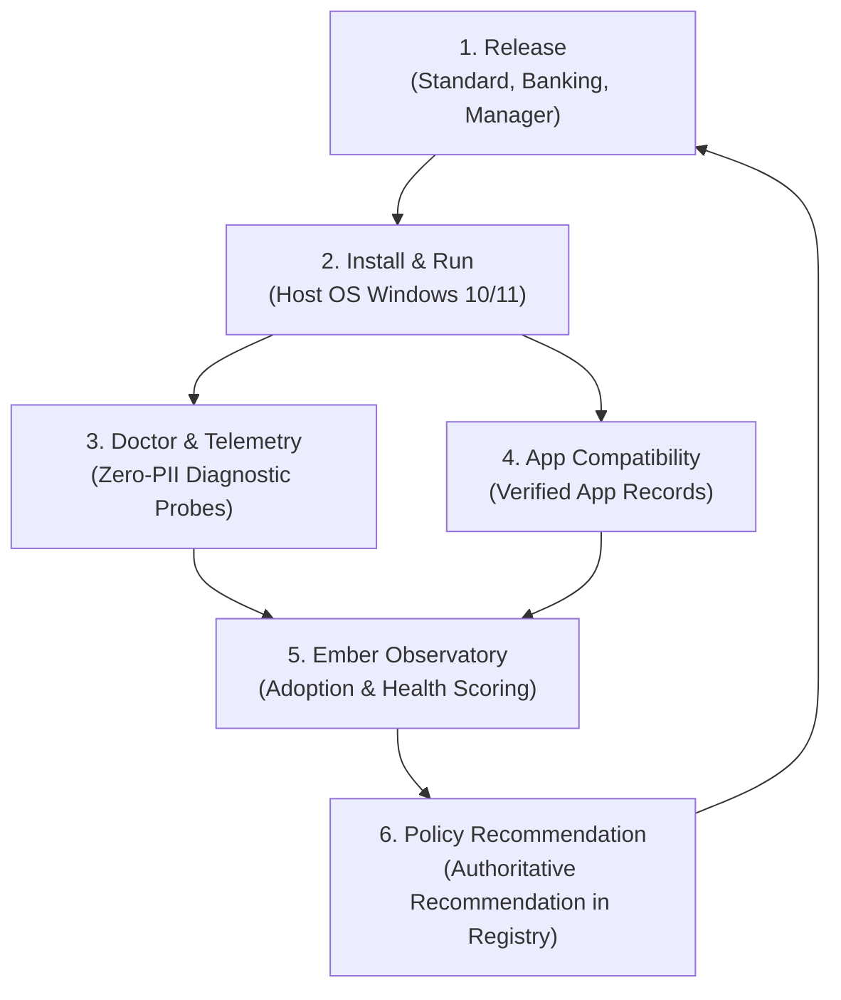

# Emberbird Closed-Loop Community Feedback Architecture

**Document Version**: `1.0.0`  
**Generated**: `2026-09-18T11:14:36Z`  
**Programme**: `PR4 – Real-World Release Adoption (Task PR4.7)`  
**Governance**: `data/releases/GOVERNANCE.md` (Execution Contract Clause 9)  

---

## 1. Closed Feedback Lifecycle

Emberbird operational excellence is driven by an automated, evidence-backed feedback cycle:

---

## 2. Feedback Stages & Operational Roles

1. **Release**: Releases are packaged and published exclusively with verified cryptographic signatures and container inspection (`scripts/release_integrity.py`).
2. **Install & Run**: Users install builds via sideloading or the Desktop Manager across supported hardware configurations.
3. **Doctor Telemetry**: The Doctor diagnostic platform (`platform/doctor`) collects local environment health (hardware virtualization, compute services, AppXSvc, storage integrity) with zero PII.
4. **App Compatibility**: The community and core maintainers submit structured compatibility records (`compatibility/data/*.json`) evaluated against `compatibility/schema.json`.
5. **Ember Observatory**: The distillation engine (`services/analytics/observatory.py`) computes composite compatibility scores and channel health.
6. **Policy Recommendation**: If a release candidate satisfies Play Integrity CTS, achieves >85% compatibility, and zero-loss recovery, the Observatory signs a formal recommendation written to `data/releases/releases.json`.

---

## 3. Strict Zero-PII Privacy Invariant

Per the Emberbird Charter and Execution Contract:
- **No IP Addresses**: Zero IP logging on website, API endpoints, or registry.
- **No Telemetry Identifiers**: No unique device GUIDs, MAC addresses, or hardware serial numbers.
- **No Personal Data**: Usernames, user profile paths, and account emails are stripped prior to aggregation.
- **Public Aggregates Only**: Telemetry is distilled strictly into publicly verifiable aggregates (`services/analytics/metrics.json`).

---
*Architecture ratified under Epic PR4 (Real-World Release Adoption), Task PR4.7.*
