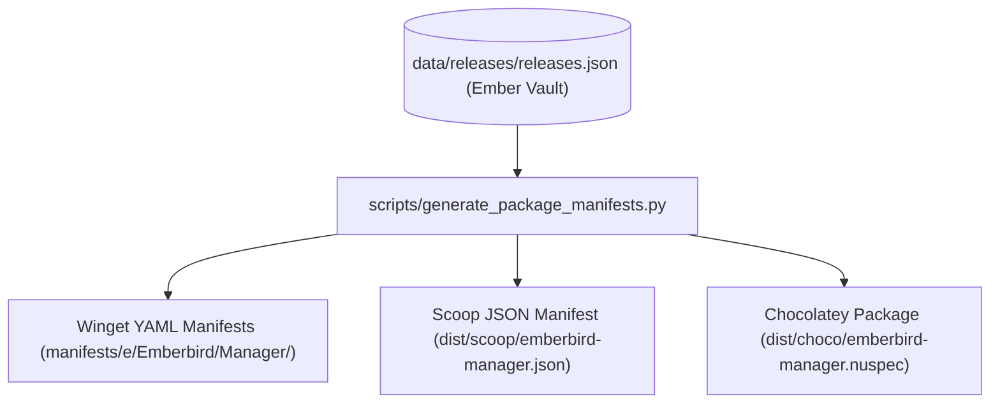

# Project Emberbird — Distribution Expansion & Package Manager Evaluation (Phase P7)

**Programme**: Distribution Automation (Phase P7)  
**Authority**: `docs/EMBERBIRD_CHARTER.md` · `data/contracts/release-contract.md` · `docs/programme-board.md`  
**Scope**: Windows Package Manager (Winget), Scoop, Chocolatey  
**Status**: COMPLETE — Architecture Ratified & Multi-Target Generator Operational

---

## 1. Executive Summary & Distribution Policy

Under the Emberbird Release Contract (clause 5) and Truth Hierarchy L1, distribution mechanisms must adhere to the **Builder Independence Rule**:
> *"Consumers derive every download URL and checksum exclusively from the Release Registry. No distribution system may scrape GitHub HTML, hardcode asset links, or fabricate release versions."*

This document evaluates the operational model, security posture, and automation mechanics for distributing the **Emberbird Desktop Manager** across the three primary Windows package managers:
1. **Windows Package Manager (Winget)** — Official Tier-1 Target (Production).
2. **Scoop** — Tier-2 Target (Developer / CLI-Centric).
3. **Chocolatey** — Tier-2 Target (Enterprise / Automation).

---

## 2. Package Manager Comparative Matrix

| Criterion | Windows Package Manager (Winget) | Scoop | Chocolatey |
|---|---|---|---|
| **Primary Audience** | Mainstream Windows 11 / 10 Users | Developers, Power Users | Enterprise Systems, DevOps |
| **Package Format** | Multi-file YAML (`version`, `installer`, `locale`) | Single JSON Manifest | NuPkg (`.nuspec` + PowerShell script) |
| **Storage Model** | Git Monorepo (`microsoft/winget-pkgs`) | Git Custom Bucket / `Main` | Community Repository (Push API) |
| **Installation Model** | System / Machine-wide installer | User-space portable extraction | System-wide package installation |
| **Integrity Enforcement** | Cryptographic SHA-256 mandatory | Cryptographic SHA-256 mandatory | SHA-256 checksum required in script |
| **Release Registry Alignment** | **100% Native** (Vault-derived) | **100% Native** (Vault-derived) | **100% Native** (Vault-derived) |
| **Support Tier in Emberbird** | **Tier 1 (Official)** | **Tier 2 (Supported)** | **Tier 2 (Supported)** |

---

## 3. Package Manager Technical Architectures

### 3.1 Windows Package Manager (Winget) — Tier 1
- **Manifest Directory Structure**: `manifests/e/Emberbird/Manager/<version>/`
- **Files**:
  - `Emberbird.Manager.yaml` (Root manifest)
  - `Emberbird.Manager.installer.yaml` (Installer architecture, URL, and SHA-256)
  - `Emberbird.Manager.locale.en-US.yaml` (Metadata, description, publisher, licensing)
- **Governance Constraint (Rule M4)**: Published historical manifests under `WSABuilds.WSABuildsManager` (versions `0.2.0`, `0.2.1`, `0.2.2`) are permanently frozen in `manifests/w/` and must never be altered or deleted. New releases publish strictly under `Emberbird.Manager`.

### 3.2 Scoop — Tier 2 (Portable Bucket)
- **Bucket Architecture**: Custom bucket `emberbird` or submission to `extras`.
- **Manifest Format**:
  ```json
  {
    "version": "0.2.2",
    "description": "Desktop Subsystem Lifecycle Manager for Emberbird",
    "homepage": "https://emberbird.azmathulla.dev",
    "license": "AGPL-3.0",
    "url": "https://github.com/IamAzmathullaShaikh/Emberbird/releases/download/v0.2.2/WSABuildsManager-0.2.2-portable.zip",
    "hash": "<sha256_from_vault>",
    "bin": "EmberbirdManager.exe",
    "shortcuts": [
      ["EmberbirdManager.exe", "Emberbird Manager"]
    ]
  }
  ```
- **Evaluation**: Scoop provides seamless user-space portable execution without requiring Administrator elevation, making it ideal for Developer Mode environments.

### 3.3 Chocolatey — Tier 2 (Enterprise Deployment)
- **Packaging Format**: Open Packaging Conventions (`.nupkg`) wrapping:
  - `emberbird-manager.nuspec`: Package metadata, licenseUrl, projectUrl.
  - `tools/chocolateyInstall.ps1`: `Install-ChocolateyZipPackage` invoking authentic release bytes and vault SHA-256 digest.
- **Evaluation**: Suitable for automated enterprise provisioning scripts (`choco install emberbird-manager`).

---

## 4. Automated Manifest Generation Pipeline

To eliminate manual packaging errors, `scripts/generate_package_manifests.py` provides unified generation across all three formats:



1. **Deterministic Inputs**: The generator reads **only** `data/releases/releases.json` and `deployment/version.json`.
2. **Hash Authority**: Checksums are retrieved directly from the Vault cut `(artifact, sha256)`.
3. **Idempotence**: Re-running the generator without new registry entries produces byte-stable output.
