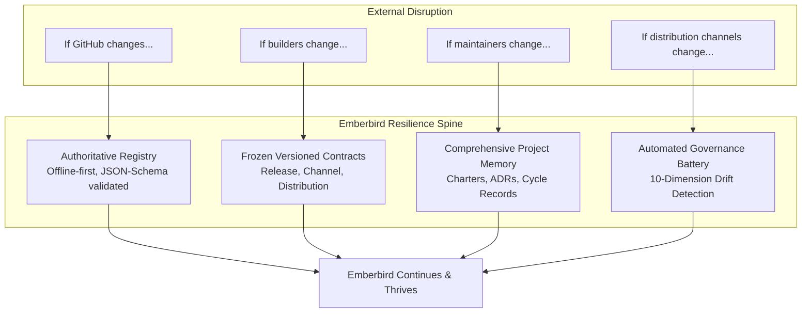

# Emberbird — Programme Intelligence System Specification

**Platform**: Emberbird (Production Stewardship Edition)  
**System**: AntiGravity Programme Intelligence System  
**Authority**: `docs/EMBERBIRD_CHARTER.md` · `docs/PHOENIX_CHARTER.md` · `data/releases/GOVERNANCE.md`  
**Classification**: Authoritative System Operating Model  

---

## 1. Executive Mandate & System Purpose

AntiGravity acts as the **authoritative programme intelligence system** for Project Emberbird.

The mission of the Programme Intelligence System is to:
1. **Maintain Project Memory**: Preserve institutional context, decision lineage, cycle logs, and operational history across maintainer sessions and tools.
2. **Track Governance**: Enforce the frozen platform architecture, release governance policies, brand standards, and branch hygiene.
3. **Track Contracts**: Guard the immutable interfaces governing release metadata, channels, consumers, and distribution packages.
4. **Track Decisions**: Maintain the Architecture Decision Records (ADRs) register and the G4 Programme Control Board.
5. **Track Future Programmes**: Bound all future platform expansion strictly to formally chartered, sequenced programmes (Phase D1 Doctor, Phase A1 Snapdragon, Phase R1 Genesis).
6. **Detect Drift**: Continuously audit the 10 dimensions of repository and platform drift before changes land.
7. **Protect Architectural Integrity**: Uphold the fundamental data pipeline:
   $$\text{Reality} \longrightarrow \text{Registry} \longrightarrow \text{Contracts} \longrightarrow \text{Consumers}$$
8. **Preserve Provenance & Legal Obligations**: Ensure attribution, historical releases (M4), upstream lineage (S1), and AGPL-3.0 / CC-BY-NC-ND obligations remain intact forever.

---

## 2. Core Operating Axioms

The platform operates on five foundational axioms:

1. **Published Artifacts Are Truth**:
   Reality is measured by published package bytes (`.7z`, `.exe`, `.zip`) and their cryptographic hashes (SHA-256). Reality always overrides documentation, assumptions, or commentary.
2. **Registry Reflects Reality**:
   The release registry (`data/releases/releases.json`) is the singular, validated, machine-readable record of published releases. It is regenerated from reality and never hand-fabricated.
3. **Contracts Define Reality**:
   Versioned schemas (`releases.schema.json`) and governance contracts (`release-contract.md`, `channel-contract.md`) specify what valid data looks like. Changes to contracts are additive by default and strictly version-governed.
4. **Consumers Trust Contracts**:
   End-user applications (Manager desktop app, website portal, downloads catalog, CLI utilities) consume only the Registry via Contracts. Consumers never scrape raw web pages, never parse unstructured release bodies at runtime, and never query unversioned endpoints.
5. **Nothing Trusts Assumptions**:
   No release status, package URL, SHA-256 checksum, or device compatibility claim is inferred. If evidence is absent, the status is honestly reported as `UNKNOWN` or `REQUIRES TARGET ENVIRONMENT VALIDATION`.

---

## 3. The Four Future Success Tests (Durability Matrix)

Emberbird is engineered to survive organizational, infrastructural, and environmental disruption:



1. **If GitHub changes, Emberbird continues**:
   The release registry is completely self-contained within the repository. The release engine and client consumers run 100% offline without GitHub API access. If GitHub disappears, the repository and its release vault remain fully operational.
2. **If builders change, Emberbird continues**:
   Builders build releases; the registry describes releases; consumers consume releases. Builders are decoupled from consumer code. Any compliant build pipeline (GitHub Actions, local scripts, Azure DevOps, self-hosted runners) producing verified artifacts can feed the registry.
3. **If maintainers change, Emberbird continues**:
   Project memory is not locked in any individual's head. Every architectural decision is recorded in [docs/ADR.md](ADR.md); every programme milestone is tracked in [docs/programme-board.md](programme-board.md); onboarding takes less than 30 minutes via [CONTRIBUTING.md](../CONTRIBUTING.md); all operational procedures are documented in [docs/LEARNING_PATH.md](LEARNING_PATH.md).
4. **If distribution channels change, Emberbird continues**:
   Distribution packages (Winget, direct zip, installer) are projections of registry truth governed by [data/contracts/release-contract.md](../data/contracts/release-contract.md). If Winget or any package manager alters policies, new channels can be added additively without touching core WSA builds.

---

## 4. Ten Invariants of Architectural Integrity & Drift Auditing

AntiGravity continuously audits and enforces ten fundamental invariants across the repository:

| # | Dimension | Invariant Standard | Automated Verification Tool |
|---|---|---|---|
| **1** | **Registry Integrity** | `releases.json` conforms to `releases.schema.json`; zero placeholder hashes; all vault entries indexed by `(artifact, sha256)`. | `python platform/release-engine/release_engine validate --schema` |
| **2** | **Consumer Compliance** | Zero direct GitHub release API or HTML scraping in production frontends (`website/src/`, `apps/manager/src/`). All consumers read bundled registry. | `python -m unittest tests/test_consumer_compliance.py` |
| **3** | **Documentation Integrity** | 100% of internal relative Markdown links resolve cleanly; docs-mirror guard passes for all mirrored docs. | `python scripts/check_doc_links.py` & `tests/test_docs_mirror.py` |
| **4** | **Secret & Credential Posture** | Zero personal access tokens, private keys, passwords, or developer filesystem paths in tracked files. | `python scripts/security_scan.py` |
| **5** | **Privacy & Zero-PII** | Zero personal data, device identifiers, or telemetry scraping. Telemetry is opt-in and disabled by default. | `python scripts/validate_analytics.py` |
| **6** | **Distribution Synchronization** | `deployment/version.json`, `manifests/e/Emberbird/Manager/`, and desktop client configuration are strictly synchronized. | `python scripts/validate_distribution.py` |
| **7** | **Historical Preservation** | Historical releases (M4), upstream attribution to MustardChef/WSABuilds/Magisk (S1), and AGPL-3.0 / CC-BY-NC-ND notices are immutable. | `python -m unittest tests/test_governance_guards.py tests/test_attribution_preservation.py` |
| **8** | **Branch & WIP Hygiene** | Remote protected branches (`main`, `master`, `experimental`, `gh-pages`) kept; 5 preserved ARM64 WIP diffs kept intact until Phase A1. | `docs/BRANCH_HYGIENE.md` & working tree check |
| **9** | **Offline Test Suite** | 100% of core Python unit tests pass offline without network access; website and manager test suites pass. | `python -m unittest discover -s tests` |
| **10** | **CI/CD Workflow Truth** | Every GitHub Actions workflow in `.github/workflows/` is documented in `WORKFLOWS.md` with valid triggers and accurate steps. | `python -m unittest tests/test_e7_purity_audit.py` |

---

## 5. Programme Control & Sequenced Roadmap

All platform work is categorized into one of two operational states:
1. **Steady-State Production Stewardship (Active)**:
   - Maintenance, documentation excellence, security patches, dependency upkeep, validation, and distribution.
   - Core platform architecture remains strictly **FROZEN**.
2. **Formally Chartered Future Programmes (Sequenced)**:
   - New capabilities are strictly prohibited from entering via ad-hoc pull requests.
   - Future work requires an approved charter on the [Programme Control Board](programme-board.md):

```text
Sequence 1: Phase D1 — Project Doctor (Diagnostic & Remediation CLI)
   Charter: docs/charters/DOCTOR_CHARTER.md
   Operating Model: stdlib-first Python, read-only audit default, elevated --fix, --json IPC output.

Sequence 2: Phase A1 — Project Snapdragon (ARM64 Enablement)
   Charter: docs/charters/ARM64_CHARTER.md
   Operating Model: Unfreezes 5 preserved ARM64 diffs; hybrid BYOB (--wsa-file) + FE3 preview discovery.

Sequence 3: Phase R1 — Project Genesis (Android 14 Research)
   Charter: docs/charters/ANDROID14_RESEARCH_CHARTER.md
   Operating Model: Investigates Treble GSI over Microsoft WSA kernel/vendor; dxgkrnl/VMBus HAL boundary mapping; strictly non-fabricating research.
```

---

## 6. Pre-Commit Programme Intelligence Gate

Before any modification is accepted into `main`, the Programme Intelligence System mandates execution of the unified verification battery:

```powershell
# Unified Programme Intelligence Audit
python scripts/programme_intelligence.py --check

# Full Unit & Guard Test Suite
python -m unittest discover -s tests

# Documentation Link & Mirror Validation
python scripts/check_doc_links.py
python -m unittest tests/test_docs_mirror.py

# Website & Desktop Client Tests
npm test --prefix website
npm test --prefix apps/manager
```

If any gate fails, the change is **REJECTED** until brought into complete alignment with Registry Truth, Contracts, and Governance.
