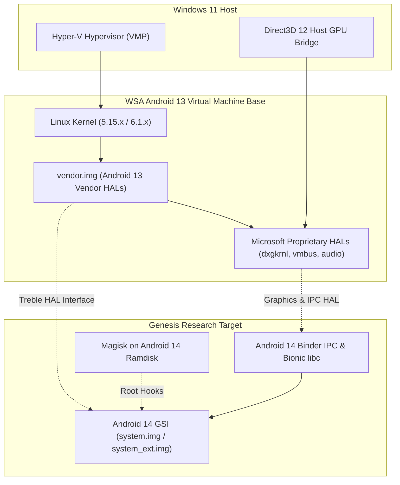

# Project Genesis — Android 14 Subsystem Research Charter (Phase R1)

**Programme Codename**: Genesis / Android 14 Research  
**Phasing**: Phase R1 (Active Future Sequence 3, following Phase A1)  
**Authority**: `docs/EMBERBIRD_CHARTER.md` · `docs/programme-board.md`  
**License**: CC-BY-NC-ND-4.0 (Research Artifacts) · AGPL-3.0 (Research Scripts)

---

## 1. Mission & Research Scope

Investigate the technical feasibility, architectural boundaries, and hardware abstraction layer (HAL) requirements for running Android 14 (API 34) within the Windows Subsystem for Android virtualization runtime.

Because Microsoft concluded official development at Android 13 (WSA `2407.40000.4.0`), sustaining Android on Windows long-term requires investigating forward runtime upgrade paths. Project Genesis explores whether an **Android 14 Generic System Image (GSI)** can boot and function over WSA's existing kernel and vendor partition layers, mapping all proprietary Microsoft paravirtualization bridges.

---

## 2. Research Principles & Constraints

1. **Non-Destructive Research**: Research is conducted in isolated test harnesses without mutating production release pipelines, committed registry truth, or stable Tier-1 builds.
2. **Treble-First Methodology**: Rather than attempting a full, unmaintainable AOSP source tree re-compilation, the investigation focuses on **Project Treble GSI compliance**: swapping `system.img` while preserving WSA's existing `vendor.img` and kernel.
3. **Honest Architectural Reporting**: If technical blockers (e.g. proprietary HAL ABI incompatibilities or kernel driver deficits) prevent stable execution, the findings are documented truthfully without speculative claims.

---

## 3. Key Investigation Domains

### Technical Investigation Matrix

| Research Domain | Technical Focus | Primary Risk / Question |
|---|---|---|
| **1. Treble GSI Compatibility** | Booting an AOSP 14 GSI (`arm64-v8a` or `x86_64`) using WSA's existing `vendor.img`. | Will Android 14 Bionic and `init` successfully load Android 13 vendor HAL libraries without symbol errors? |
| **2. Proprietary GPU HAL (`dxgkrnl`)** | Compatibility of Microsoft's `libdxcore.so` and `vulkan.dxcore.so` under Android 14. | Do Direct3D 12 paravirtualized graphics calls function under Android 14's SurfaceFlinger and RenderEngine? |
| **3. VMBus & Synthetic Drivers** | Host-guest clipboard, window resizing, and audio bridges. | Are VMBus IPC protocols compatible with Android 14 security policies? |
| **4. SELinux & Treble Policy** | Android 14 security policy enforcement. | Does Android 14's stricter sepolicy break WSA's custom init services (`wsa_service`, `redfin` spoofing)? |
| **5. Magisk Root Trampoline** | Dynamic linker and `lspinit` on Android 14. | Does Magisk Stable (v30.6+) require modified init trampoline hooks for Android 14 CPIO ramdisks? |

---

## 4. Deliverables & Go/No-Go Decision Criteria

### Planned Research Deliverables
1. **`docs/research/ANDROID14_FEASIBILITY.md`**: Comprehensive technical audit documenting boot logs (`logcat`, `dmesg`), HAL binding results, and graphics benchmark data.
2. **HAL Compatibility Matrix**: Detailed inventory of every shared library in `/vendor/lib64/` and its compatibility status with Android 14 libc/libbinder.
3. **Proof-of-Concept Test Rig**: Automated local testing script (`tools/research/test_gsi_boot.py`) to unpack WSA, swap `system.img`, and capture boot diagnostics.

### Formal Go/No-Go Criteria
- **GO Condition**: Android 14 GSI boots to home launcher, accelerates 2D/3D graphics via `dxgkrnl`, and establishes functional network connectivity.
- **NO-GO Condition**: Proprietary Microsoft HALs crash due to unresolvable Bionic ABI breakages without host-side hypervisor source modifications. If NO-GO, the platform maintains Android 13 as the permanent, hardened LTS base.
