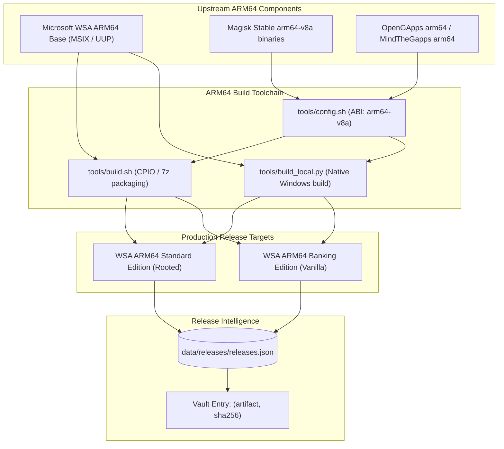

# Project Snapdragon — ARM64 Enablement Programme Charter (Phase A1)

**Programme Codename**: Snapdragon / ARM64 Enablement  
**Phasing**: Phase A1 (Active Future Sequence 2, following Phase D1)  
**Authority**: `docs/EMBERBIRD_CHARTER.md` · `docs/research/ARM64_CROSS_COMPILATION.md` · `docs/programme-board.md`  
**License**: AGPL-3.0 (Tooling & Scripts) · CC-BY-NC-ND-4.0 (Documentation)

---

## 1. Mission & Objective

Enable native ARM64 compilation, patching, and execution for the Windows Subsystem for Android targeting Qualcomm Snapdragon devices (including Snapdragon X Elite / Copilot+ PCs) and Windows 11 on ARM.

ARM64 devices run Android applications with native performance without the CPU translation overhead of binary translators (libhoudini / libndk). Project Snapdragon delivers the complete build toolchain, ramdisk patching mechanics, and packaging pipeline to support ARM64 hardware as an official Tier-1 production target.

---

## 2. Foundational Principles & Truth Alignment

1. **Truth Hierarchy L1 (Published Artifacts Are Truth)**: Microsoft never published a retail x64/arm64 unified MSIX bundle on the retail channel. Therefore, the official release registry (`releases.json`) will list pre-built ARM64 releases **only** when verified, cryptographically sealed byte artifacts are published. Never invent or synthesize a release without real bytes.
2. **Hybrid Ingestion Model**:
   - **Phase A1.1 (Bring-Your-Own-Bundle)**: Build scripts immediately support local user-provided base MSIX bundles via `--wsa-file <path_to_arm64.msix>` or local directories.
   - **Phase A1.2 (FE3 Discovery Research)**: Tooling automates discovery and checksum verification of historical preview/Insider ARM64 packages directly from Microsoft's Windows Update Delivery Network.
3. **Preserved Baseline Continuity**: The uncommitted research diffs (`tools/build.sh`, `tools/config.sh`, `tools/build_local.py`, `tools/generateGappsLink.py`) serve as the authoritative technical baseline.

---

## 3. Technical Architecture & Component Matrix

### Component Details

| Subsystem | ARM64 Implementation Details |
|---|---|
| **Initrd Trampoline** | Cross-compile CPIO ramdisk with `lspinit`, `init-ld.xz`, and Magisk 64-bit ARM dynamic loader. |
| **Magisk Root** | Extract `lib/arm64-v8a/libmagisk.so`, `magiskboot`, and `magiskpolicy` from official Magisk APK. |
| **Google Apps** | Overlay OpenGApps `arm64` (Pico) ext4 image or LineageOS MindTheGapps arm64 onto `system.img`. |
| **Binary Translation** | Omit x86_64 libhoudini / libndk layers; native Snapdragon execution delivers pure arm64/arm32 ABI support. |
| **AppX Manifest** | Set `ProcessorArchitecture="arm64"` in `AppxManifest.xml`; configure identity for Windows on ARM deployment. |

---

## 4. Execution Phases & Work Orders

- **Phase A1.1 (Baseline Commit & Tooling Alignment)**:
  - Formally commit and stage the preserved research diffs in `tools/build.sh`, `tools/config.sh`, `tools/build_local.py`, and `tools/generateGappsLink.py`.
  - Update `docs/ARCHITECTURE.md` Section 5 to reflect active ARM64 development status.
- **Phase A1.2 (Local Bring-Your-Own-Bundle Pipeline)**:
  - Support `--wsa-file` and `--arch arm64` in both `build.sh` and `build_local.py`.
  - Validate local assembly on Windows 11 on ARM and WSL2 cross-build environments.
- **Phase A1.3 (FE3 Preview Discovery Automation)**:
  - Extend `scripts/build_registry.py` and FE3 update checkers to probe for authentic Microsoft ARM64 build hashes.
- **Phase A1.4 (Automated Packaging & Registry Publication)**:
  - Produce verified `.7z` solid archives for ARM64 Standard and Banking editions.
  - Compute authentic SHA-256 digests and add valid ARM64 release rows to `data/releases/releases.json`.
- **Phase A1.5 (Target Environment Hardware Verification)**:
  - Validate deployment, Google Play Store login, and Magisk root on physical Snapdragon X Elite / Qualcomm Snapdragon hardware.
