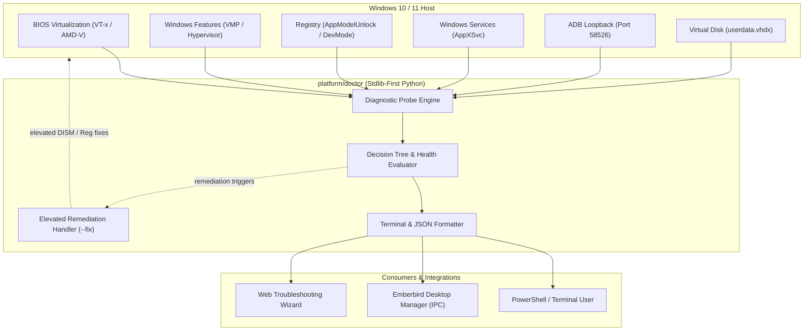

# Project Doctor — Diagnostic & Remediation CLI Charter (Phase D1)

**Programme Codename**: Doctor  
**Phasing**: Phase D1 (Active Future Sequence 1)  
**Authority**: `docs/EMBERBIRD_CHARTER.md` · `docs/programme-board.md`  
**License**: AGPL-3.0 (Tooling) · CC-BY-NC-ND-4.0 (Documentation)

---

## 1. Mission & Objective

Deliver an automated, stdlib-first diagnostic and self-healing CLI for the Windows Subsystem for Android host environment.

Project Doctor addresses the #1 source of community support requests: host virtualization configuration issues, Windows Developer Mode restrictions, ADB connectivity drops, and AppX deployment failures. It empowers end users and developers to identify and remediate environmental faults in seconds without manual registry editing or guesswork.

---

## 2. Core Invariants & Safety Doctrine

1. **Read-Only by Default**: The tool defaults to non-destructive inspection. It can be run safely by any unprivileged user to generate diagnostic reports.
2. **Explicit Elevation for Remediation**: The `--fix` remediation mode requires explicit Administrator privileges and prompts for user confirmation before modifying system state.
3. **Data Preservation Absolute**: Project Doctor must **never** delete, truncate, or overwrite user virtual disk data (`userdata.vhdx`).
4. **Zero-PII Compliance**: Diagnostic outputs (both terminal text and JSON) must never include personal user identities, machine serials, or private network tokens.
5. **Headless & Machine-Readable**: Diagnostic results can be emitted as structured JSON (`--json`) for direct ingestion by the Desktop Manager (`apps/manager`) and the Web Troubleshooting Wizard.

---

## 3. Technical Architecture



---

## 4. Diagnostic Probes Specification

The probe engine evaluates seven distinct diagnostic domains:

| Probe ID | Domain | Target Inspection | Remediation Command (`--fix`) |
|---|---|---|---|
| **PRB-01** | Hardware Virtualization | WMI `Win32_Processor` `VirtualizationFirmwareEnabled` | Alert user to enable Intel VT-x / AMD-V in BIOS/UEFI. |
| **PRB-02** | Virtual Machine Platform | DISM feature status: `VirtualMachinePlatform` | `dism.exe /online /enable-feature /featurename:VirtualMachinePlatform /all /norestart` |
| **PRB-03** | Hypervisor Platform | DISM feature status: `HypervisorPlatform` | `dism.exe /online /enable-feature /featurename:HypervisorPlatform /all /norestart` |
| **PRB-04** | Windows Developer Mode | Registry: `HKLM\SOFTWARE\Microsoft\Windows\CurrentVersion\AppModelUnlock` `AllowDevelopmentWithoutDevLicense` | `reg add "HKLM\SOFTWARE\Microsoft\Windows\CurrentVersion\AppModelUnlock" /t REG_DWORD /f /v "AllowDevelopmentWithoutDevLicense" /d 1` |
| **PRB-05** | AppX Deployment Service | Windows Service: `AppXSvc` state | `Start-Service -Name AppXSvc` |
| **PRB-06** | ADB Loopback Binding | TCP connection probe to `127.0.0.1:58526` | Prompt user to toggle USB Debugging in WSA Advanced Settings; run `adb connect 127.0.0.1:58526`. |
| **PRB-07** | Virtual Disk Lock | File handle check on active `userdata.vhdx` | Inspect for zombie `WsaClient.exe` or `vmcompute.exe` processes holding disk locks. |

---

## 5. CLI Interface & UX Contract

### Command Invocation
```powershell
# Read-only diagnostic scan (default)
python -m platform.doctor

# Machine-readable JSON output for integrations
python -m platform.doctor --json

# Interactive elevated self-healing mode
python -m platform.doctor --fix
```

### Exit Codes
- `0`: All diagnostic checks passed (System healthy).
- `1`: Informational or minor warnings detected (e.g. ADB disconnected but WSA running).
- `2`: Critical blocking errors detected (e.g. virtualization disabled, Developer Mode disabled).

---

## 6. Phasing & Milestone Deliverables

- **Phase D1.1 (Probe Core)**: Implement stdlib-first scanner engine in `platform/doctor/` covering PRB-01 through PRB-07.
- **Phase D1.2 (JSON Schema & CLI)**: Implement formatted terminal reporter and `--json` serialization contract.
- **Phase D1.3 (Elevated Remediation)**: Implement `--fix` execution engine with confirmation prompts and elevation checks.
- **Phase D1.4 (Desktop Integration)**: Wire `--json` scanner into `apps/manager` diagnostic screen.
- **Phase D1.5 (CI & Contract Tests)**: Author unit test battery (`tests/test_doctor.py`) with offline mock probes.
