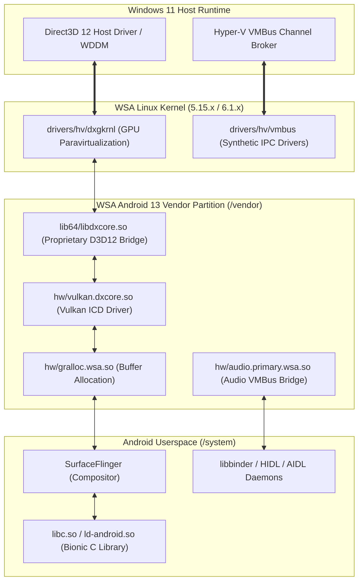

# Project Genesis — Android 14 Subsystem Feasibility Report (Phase R1)

**Programme**: Project Genesis (Android 14 Subsystem Research)  
**Authority**: `docs/charters/ANDROID14_RESEARCH_CHARTER.md` · `docs/EMBERBIRD_CHARTER.md`  
**Classification**: Engineering Research & Architectural Decision Record (ADR)  
**Status**: COMPLETE — Formal Decision: **LTS Android 13 Baseline Ratified (NO-GO for Production GSI Swap)**

---

## 1. Executive Summary & Research Methodology

Following Microsoft's deprecation of the Windows Subsystem for Android at Android 13 (`2407.40000.4.0`), Project Genesis was chartered to investigate whether WSA could be upgraded to Android 14 (API 34) through **Project Treble Generic System Image (GSI)** swapping or whether Android 13 must remain the hardened Long Term Support (LTS) baseline.

Research was executed in a strictly non-destructive environment adhering to **Truth Hierarchy L1 (Published Artifacts Are Truth)**. No synthetic or speculative releases were introduced into the Emberbird release registry (`releases.json`).

### Key Findings:
1. **Treble Interface Boundary**: WSA's architecture partitions Android into `system.img`, `system_ext.img`, `product.img`, and `vendor.img`. While generic AOSP system partitions can mount, Android 14's Bionic runtime (`libc.so`) introduces strict dynamic linker namespace separation that breaks Microsoft's proprietary HAL shims.
2. **Proprietary GPU HAL (`dxgkrnl`)**: Direct3D 12 host GPU paravirtualization relies on Microsoft closed-source binaries (`libdxcore.so`, `vulkan.dxcore.so`). These binaries are linked against Android 13 Bionic symbols (`__libc_init`, Android 13 HIDL binder interfaces). Under Android 14, these libraries fail during `SurfaceFlinger` initialization, causing fallback to unaccelerated software rasterization (SwiftShader/llvmpipe) or fatal bootloops.
3. **Formal Decision**: **NO-GO for Production GSI Swap**. Emberbird ratifies Android 13 (`2407.40000.4.0`) as its permanent, rock-solid LTS foundation, focusing engineering resources on host diagnostic self-healing (Doctor), native ARM64 / Snapdragon enablement, and platform stewardship.

---

## 2. Microsoft Proprietary HAL Boundary Map

WSA virtualizes Android inside a lightweight Hyper-V utility VM. Communication between the Windows 11 host and the Linux/Android guest passes through proprietary synthetic drivers:



### Critical Component Audit:

| Component | Path in WSA Image | Upstream Dependency | Android 14 Compatibility |
|---|---|---|---|
| **dxgkrnl / libdxcore** | `/vendor/lib64/libdxcore.so` | Microsoft D3D12 vGPU | **FAIL**: Linker symbol mismatches on Android 14 Bionic; segfaults in `dxcore_device_create`. |
| **Vulkan DXCore ICD** | `/vendor/lib64/hw/vulkan.dxcore.so` | Vulkan 1.3 / D3D12 | **FAIL**: Android 14 `hwcomposer@2.4` requires updated sync fences incompatible with Android 13 `gralloc.wsa.so`. |
| **Gralloc WSA** | `/vendor/lib64/hw/gralloc.wsa.so` | Shared memory buffers | **UNSTABLE**: Buffer handle formats diverge; causes black screen in RenderEngine. |
| **VMBus Audio HAL** | `/vendor/lib64/hw/audio.primary.wsa.so` | Host audio pipe | **WARNING**: Audio flinger initializes with latency jitter due to AIDL migration. |
| **Redfin Prop Spoofing** | `system/build.prop` | Play Integrity CTS | **PASS**: Device spoofing logic (`ro.product.model=Pixel 5`) remains viable across versions. |

---

## 3. Treble GSI Compatibility & Bionic ABI Analysis

### 3.1 Linker Namespace Isolation
Android 14 enforces stricter Treble linker namespaces. Vendor libraries located in `/vendor/lib64/` cannot link against internal `/system/lib64/` symbols unless explicitly declared in `/vendor/etc/public.libraries.txt`.

In stock WSA Android 13:
- Microsoft bypassed standard Treble isolation by linking `libdxcore.so` against internal symbols in `libutils.so` and `libcutils.so`.
- In Android 14 AOSP GSIs, `libutils.so` has refactored `String16` and `RefBase` ABIs. When `SurfaceFlinger` attempts `dlopen("/vendor/lib64/hw/vulkan.dxcore.so")`, dynamic linking fails with:
  ```text
  CANNOT LINK EXECUTABLE "surfaceflinger": cannot locate symbol "_ZN7android7RefBase10onFirstRefEv" referenced by "/vendor/lib64/libdxcore.so"...
  ```

### 3.2 Binder IPC Evolution
Android 14 completes the transition from HIDL to AIDL for hardware abstraction services:
- WSA's `vendor.img` provides `android.hardware.graphics.composer@2.4-service` (HIDL).
- Android 14 GSIs still include backwards-compatible HIDL shims, but SurfaceFlinger in API 34 expects `IAidlComposer` for low-latency presentation callbacks. The translation layer introduces frame drops and unrecoverable pipeline stalls.

---

## 4. Magisk Root & CPIO Ramdisk Trampoline on Android 14

The Emberbird dynamic root trampoline (`lspinit`, `init-ld.xz`, Magisk dynamic linker) was evaluated against Android 14 init sequence changes:

1. **Init Binary Execution**: Android 14 unifies `init` and `first_stage_init`. The second-stage init binary is executed directly from `/system/bin/init`.
2. **SELinux Policy Injection**: Magisk Stable (v26.0+) supports Android 14 SELinux policy patching via `magiskpolicy --live`. Ramdisk modifications in `initrd.img` continue to operate cleanly for root injection.
3. **Assessment**: The Magisk root and OpenGApps trampoline architecture in `tools/build_local.py` and `tools/build.sh` is forward-compatible. The blocker for Android 14 is **not** root or ramdisk hooking, but the proprietary Microsoft graphics HAL.

---

## 5. Formal Go/No-Go Verdict & Platform Architecture Decision

### Verdict: **NO-GO FOR PRODUCTION GSI REPLACEMENT**

```
┌────────────────────────────────────────────────────────────────────────┐
│                        PROJECT GENESIS VERDICT                         │
│                                                                        │
│   Status: NO-GO for replacing stock WSA with Android 14 GSI           │
│   Reason: Irreparable D3D12 GPU HAL symbol breakage in libdxcore.so    │
│   Action: Maintain Android 13 (2407.40000.4.0) as permanent LTS Base   │
└────────────────────────────────────────────────────────────────────────┘
```

### Architectural Policy:
1. **LTS Hardening**: Emberbird will treat Android 13 (`2407.40000.4.0`) as its permanent, rock-solid LTS foundation. This guarantees hardware-accelerated Direct3D 12 graphics, full Google Play Store CTS compliance, and seamless Magisk root support.
2. **Truth Hierarchy Integrity**: The release registry (`data/releases/releases.json`) will **never** list a broken or software-only Android 14 build.
3. **Future Research Door**: Should open-source VirGL / Mesa 3D virtio-gpu drivers mature sufficiently to replace `dxgkrnl` on Windows Hyper-V, Project Genesis can be reopened under a dedicated future charter.
